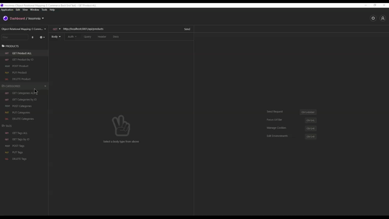

# Object-Relational Mapping (ORM): E-Commerce Back End

## Description

To build the back end for an e-commerce site. To configure a working Express.js API to use Sequelize to interact with a MySQL database.

## Table of contents

- [Installation](#installation)
- [Usage](#usage)
- [Credit](#credit)
- [Tests](#tests)
- [GitHub](#github)
- [Email](#email)
- [Questions](#questions)
- [License](#license)

  <hr>

## Installation

To start using this code follow these instructions. Be sure that corresponding files are connected and correct dependencies are installed.

```
npm i
```

```
npm i dotenv
```

```
npm i express
```

```
npm i mysql2
```

```
npm i sequelize
```


<hr>

## Usage

To drop the databse run this code in you terminal under the correct file path in this sequence:

```

mysql -u root -p

```

```

source db/schema.sql

```

After creating your database you need to seed the database by running this code:

```

npm run seed

```


To initialize run this code:

```

npm start

```

or

```

node server

```


<hr>

Using Insomnia to simulate GET, POST, PUT, DEL methods, the databse can be accessed to retrieve, alter, and remove data within the databse.




A video of the POST, PUT, and DELETE methods can be found [here.](https://youtu.be/SL85dJT06nQ)

A full demostration video from start to finish can be found [here.](https://youtu.be/0If0FoB74FE)

<hr>

## Credit

Jelani Thomas

## Tests

No tests provided

## GitHub

GeloneJT

## Email

jelani13@icloud.com

## Questions

If you questions should arise about this project or any others feel free to reach me via my email or GitHub

## License

[](https://opensource.org/licenses/MIT)


